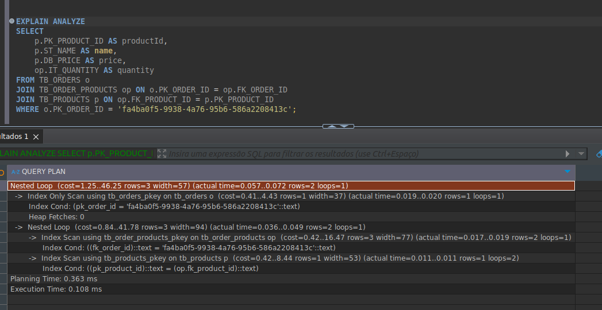

## Guia de Execução do Projeto

### Pré-requisitos

Certifique-se de que as seguintes ferramentas estejam instaladas em sua máquina:

- **Docker**

---

### Como Executar o Projeto Localmente

1. Inicie os serviços necessários:
   ```bash
   docker compose up database
   docker compose up rabbitmq
   ```

2. Após os serviços estarem ativos, execute o projeto normalmente no ambiente de desenvolvimento.

---

### Como Executar o Projeto no Docker

Para executar todo o projeto diretamente no Docker, utilize o comando:

```bash
docker compose up
```

Isso irá iniciar todos os serviços necessários automaticamente.

---

## Arquitetura e Comunicação

### Diagrama

Abaixo está o diagrama ilustrando a arquitetura do sistema:


### Componentes do Sistema

### 1. **Projeto A**
Este componente é responsável por gerar os pedidos e disponibilizá-los por meio de uma fila para o serviço de pedidos.

### 2. **Order API**
A **Order API** consome os pedidos gerados pelo Projeto A, processa as informações e realiza cálculos, como a soma dos produtos.
O **Order API** possui validações para consumir os pedidos, caso o pedido não atenda,ele não será processado.

### 3. **Projeto B**
O Projeto B consome o serviço **Order API**. O **Order API** expõe um endpoint que permite buscar um pedido específico pelo seu ID.

---

### Curls

### 1- **Buscar pedido**

```bash
curl --location 'http://localhost:8080/v1/order/f28a67b5-66ff-4021-91c3-cce381fa39b5'
```

 - **Obs:** se a aplicação estiver no container, mude a porta pra: 80

### 2 - **Cadastrar pedido na fila**

```bash
curl --location 'http://localhost:15672/api/exchanges/%2F/amq.default/publish' \
--header 'Content-Type: application/json' \
--header 'Authorization: Basic YWRtaW46YWRtaW4=' \
--data '{
           "properties": {},
           "routing_key": "order_queue",
           "payload": "{\"order_id\": \"f28a67b5-66ff-4021-91c3-cce381fa39b8\", \"client_id\": \"789e0123-e89b-12d3-a456-426614174006\", \"products\": [{\"product_id\": \"011\", \"name\": \"Webcam\", \"price\": 45.99, \"quantity\": 1}], \"order_date\": \"2024-12-05\"}",
           "payload_encoding": "string"
         }'
```
---

### Teste de latência

 - Para fazer um teste de latência com uma grande carga de dados no banco de dados, foi necessário popular o banco:


 - O resultado de algumas pesquisas foi:


---

---

---
